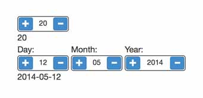

  Angular/Bootstrap - stepper
=================

A simple step numeric input written in angular with bootstrap styling. It also contains a simple date input element 
if you don't want to use the bootstrap's datepicker.

No JQuery needed, no extra dependency needed.

Being writen by someone that does this as a hobby, it sure needs a lot of inprovments and also testing outside webkit.
I can't imagine what IE does with it and, to tell you the truth, using IE should get you ashamed not angry because 
of impropper rendering.

No validation required because the directive inhibits any other input except digits and also limits the input to the min, max attributes.

The library contains two directives:

step-number
usage: 

    <step-number ng-model="yourVar" max="youMaxValue" min = "yourMinValue"></step-number>

step-date

usage: 

    <step-date ng-model="yourDate"></step-date>

To do: there is a huge regExp that checks if a date is valid including leap years. It might be nice to include some validation capabilities. Also a configuration object to be passed to the element would be a bonus.

This is how it looks like rendered with the default bootstrap theme:

Here is a working [demo](http://www.stepper.blinduben.ro).

Enjoy!
